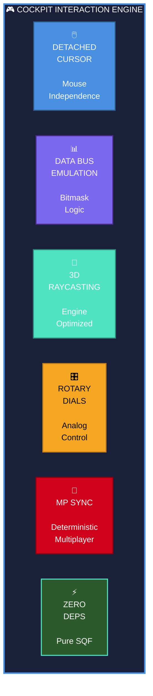
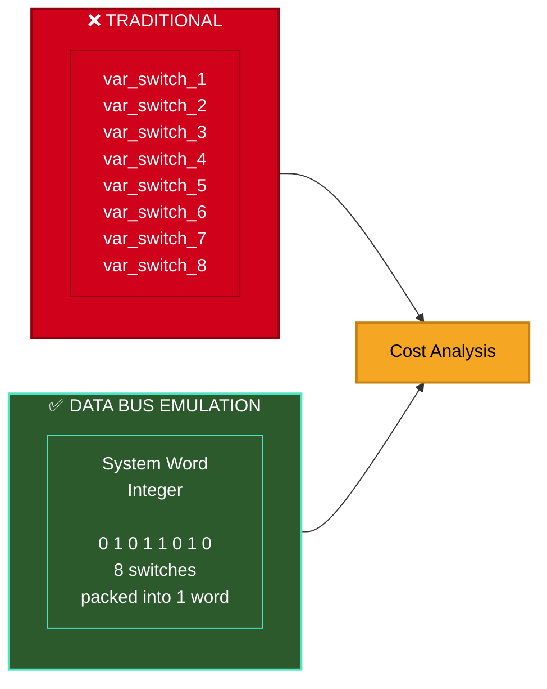
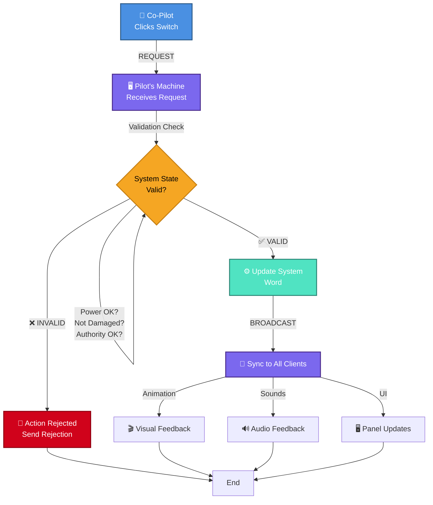
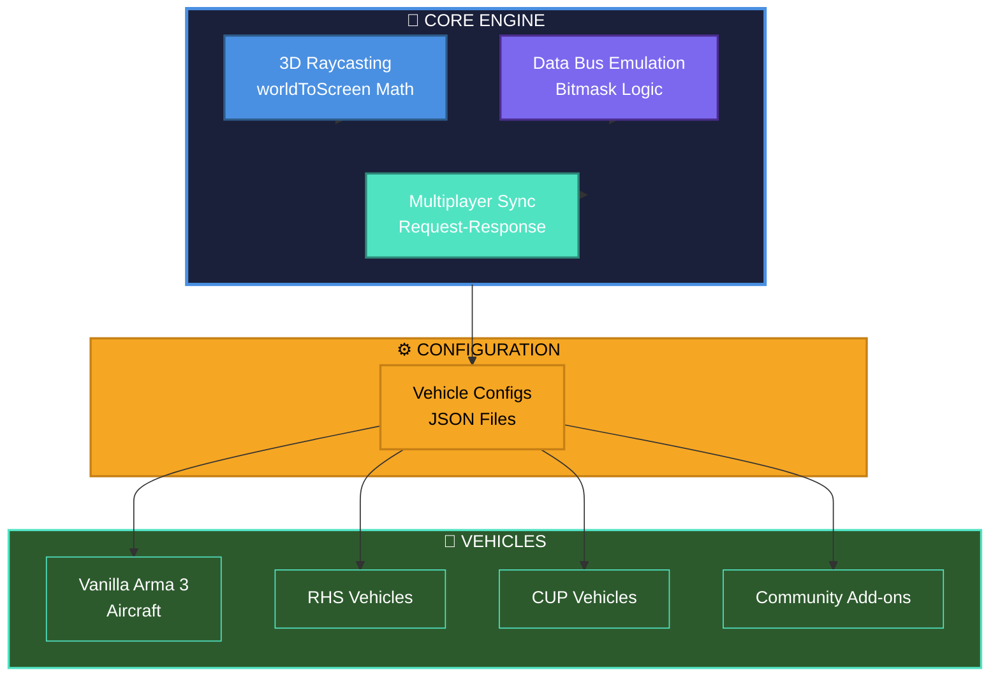
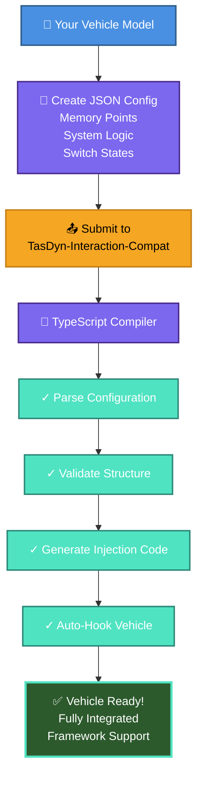
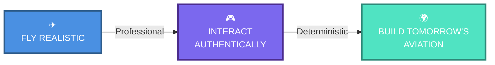

# 🎮 Tasman Dynamics - Interaction Framework

[](LICENSE)
[](https://community.bistudio.com/)
[](https://arma3.com/)

> A standalone, high-performance **Data Bus-driven 3D interaction engine** for Arma 3.

Developed by Tasman Dynamics, this framework bridges the gap between traditional Arma 3 vehicle controls and professional-grade flight simulation. It allows pilots to interact with complex cockpit systems using a detached mouse cursor, driven by a logic-first architecture inspired by real-world aviation standards.

---

### 🎯 Overview



## ✨ Key Features

| Icon | Feature | Details |
|:----:|---------|---------|
| 🖱️ | **Detached Interactive Cursor** | Decouples mouse movement from head-tracking. Pilots maintain flight stability on HOTAS/Collective while manipulating overhead panels. |
| 📊 | **Data Bus Emulation (DBE)** | Processes interactions as digital "Words" (bitmasks) across simulated data bus, mirroring ARINC 429 and MIL-STD-1553 standards. |
| 🔄 | **Deterministic Multiplayer Sync** | High-fidelity synchronization ensures every crew member sees identical instrument state via request-response pattern. |
| ⚡ | **High-Performance 3D Raycasting** | Optimized engine-level math ensures zero framerate impact across hundreds of interactive nodes. |
| 🎛️ | **Rotary Dial & Axis Support** | Smooth analog-style control of radio frequencies, lighting dimmers, and volume knobs via Z-axis intercept. |
| 🚀 | **Zero Dependencies** | Pure vanilla Arma 3 UI and SQF. No CBA_A3 or external dependencies. |

## 🛰️ The Engineering: Data Bus Emulation

To achieve maximum realism and network efficiency, the framework treats the cockpit as a digital ecosystem rather than a collection of independent scripts.

### System-Oriented Synchronization

Instead of syncing 200 individual variables for 200 switches, the framework packs switch states into System Words using bitmasking. A single integer can represent the state of an entire electrical bus or fuel panel.



**Efficiency Comparison:**
| Metric | Traditional | Data Bus |
|--------|:-----------:|:--------:|
| Network Transmissions | ❌ 8 | ✅ 1 |
| Bandwidth Usage | ❌ High | ✅ Minimal |
| Sync Complexity | ❌ High | ✅ Deterministic |

### Master Bus Controller Logic

The vehicle "Owner" (the Pilot) acts as the Bus Controller.



## 🏗️ Architecture Philosophy

This repository contains the core interaction engine. It is strictly decoupled from proprietary assets.

By separating the math and network logic from vehicle models, server admins can run this framework as a lightweight, universal dependency. Community modders can hook their own vehicles into the system by simply providing a data-driven configuration.



**Architecture Benefits:**
- 🎯 Single source of truth for cockpit logic
- 🔗 Seamless integration with any vehicle model
- 📦 Lightweight core with modular expansion

## 🛠️ Building from Source

This project utilizes **HEMTT** (Highly Extensible Modding Toolchain) for compilation and PBO packing.

### Prerequisites

- **HEMTT** ([Get Latest Release](https://github.com/BrettMayson/HEMTT/releases)) — installed and added to your system PATH

### Build Instructions

```bash
# 1. Clone this repository
git clone <repo-url>

# 2. Navigate to the root directory
cd Tasman-Dynamics-Interaction-Framework

# 3. Build the project
hemtt build

# ✅ Output: .hemtt/out/build/@Tasman Dynamics - Interaction Framework/
```

**Build Pipeline:**

```mermaid
graph LR
    A["📁 Source Code<br/>SQF Files"] --> B["🔨 HEMTT Build"]
    B --> C["✅ Parse &<br/>Validate"]
    C --> D["📦 Pack into<br/>PBO"]
    D --> E["✓ Optimization"]
    E --> F["📦 Compiled Output<br/>@TasDyn - Framework"]
    F --> G["🚀 Ready for<br/>Deployment"]
    
    style A fill:#4a90e2,stroke:#2e5c8a,stroke-width:2px,color:#fff
    style B fill:#7b68ee,stroke:#4c2d8f,stroke-width:2px,color:#fff
    style C fill:#50e3c2,stroke:#2d8878,stroke-width:2px,color:#fff
    style D fill:#f5a623,stroke:#c68015,stroke-width:2px,color:#000
    style E fill:#50e3c2,stroke:#2d8878,stroke-width:2px,color:#fff
    style F fill:#2d5a2d,stroke:#50e3c2,stroke-width:2px,color:#fff
    style G fill:#4a90e2,stroke:#2e5c8a,stroke-width:2px,color:#fff
```



## 🤝 Contributing & Compatibility

We utilize a **Data-Driven Configuration model**. If you wish to make a vehicle (Vanilla, RHS, CUP, etc.) compatible with this engine, you do not need to write SQF.

### How It Works



### Getting Started

**Visit:** [TasDyn-Interaction-Compat](https://github.com/A3-TasmanDynamics/TasDyn-Interaction-Compat) (Companion Repository)

**Supported Vehicle Types:**
- ✅ Vanilla Arma 3 Aircraft
- ✅ RHS Vehicles
- ✅ CUP Vehicles
- ✅ Community Add-ons

Submit a JSON file with your vehicle's memory points and system logic. Our TypeScript-based compiler will automatically generate the necessary injection code to hook your vehicle into the framework.

## 📄 License

This framework is released under the **Arma Public License Share Alike (APL-SA)**.

| Capability | Permission |
|:-----------|:----------:|
| 🔓 Non-commercial Use | ✅ Allowed |
| ✏️ Modification | ✅ Allowed |
| 📦 Redistribution | ✅ Allowed |
| 🌍 Remain in Arma Universe | ✅ Required |
| 📝 Derivatives under APL-SA | ✅ Required |

See the [LICENSE](LICENSE) file for full details.

---

<div align="center">

## 🌟 Enterprise-Grade Flight Simulation

**Tasman Dynamics** | Arma 3 Aviation Framework

### Core Promise



### Why Tasman Dynamics?

| Aspect | Benefit |
|:------:|---------|
| 🏗️ **Architecture** | Decoupled, modular, enterprise-ready |
| ⚡ **Performance** | Zero framerate impact at scale |
| 🔗 **Integration** | Works with any Arma 3 vehicle |
| 🛡️ **Reliability** | Deterministic multiplayer sync |
| 📚 **Ecosystem** | Growing community & support |

---

### Get Involved

**[📚 Documentation](docs/)** • **[🐛 Report Issues](issues/)** • **[💬 Community](discussions/)** • **[📢 Updates](announcements/)**

### Support & Resources

- 🚀 [Quick Start Guide](QUICK_START.md)
- 📖 [Full Documentation](docs/)
- 🐛 [Known Issues & Roadmap](issues/)
- 💬 [Community Forum](discussions/)

---

Made with ❤️ by **Tasman Dynamics** for the Arma 3 Aviation Community

**Version**: 1.0.0 | **License**: APL-SA | **Status**: Production Ready ✅

</div>